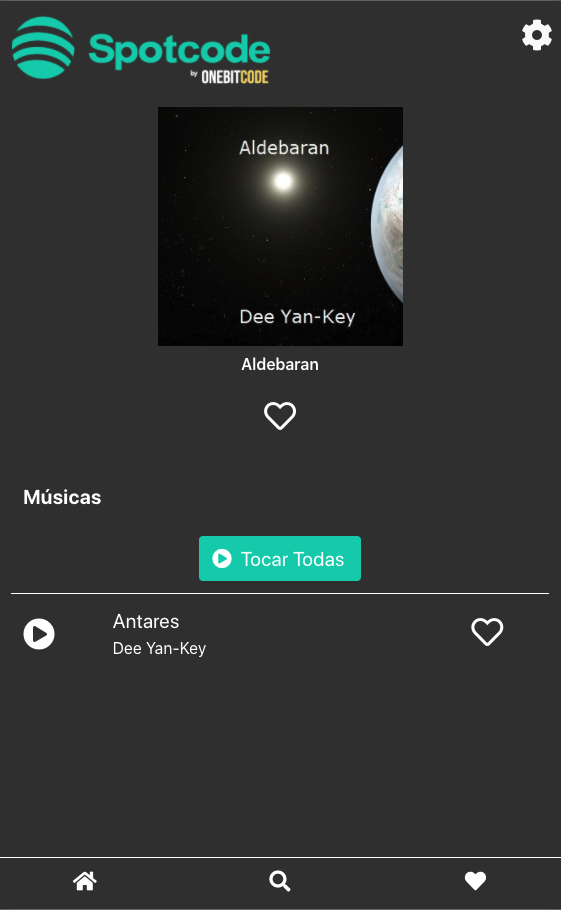
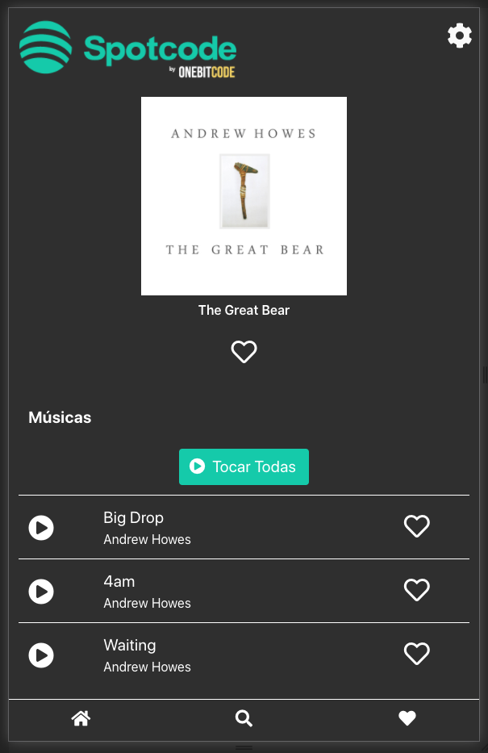
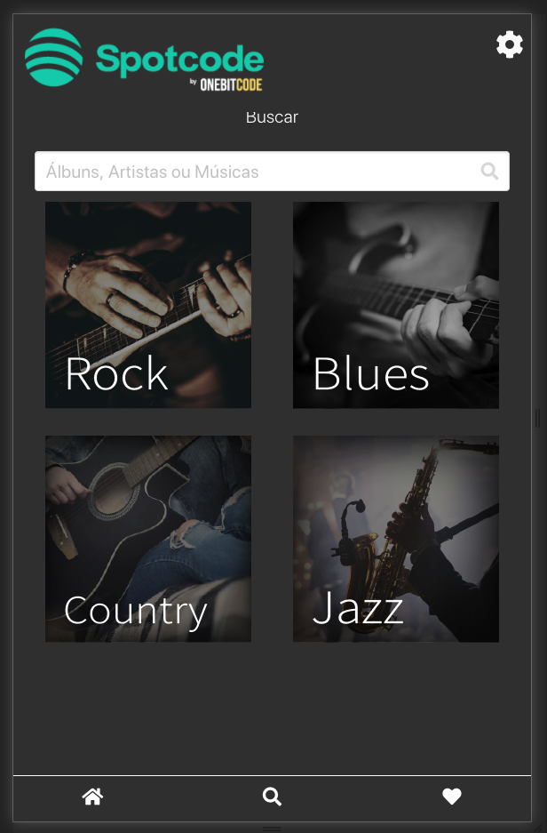
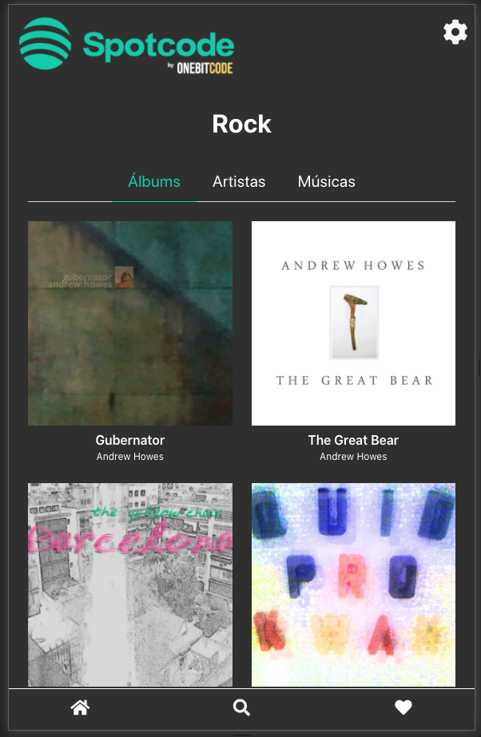

# Spotcode
Music streaming service which allows users to listen to their favorite songs.

As an `User` you can:
```
  -> Play your favorite songs
  -> Search new songs
  -> Add songs to your list of favorite songs
  -> Play the songs played recently
  -> Discovery new songs based on your favorite genre
```

# App Preview
`Song page`

  

- - - - -

`Album page`

  

- - - - -

`Search page`

  

- - - - -

`Music by genre`

  

## Ruby Verion
Ruby 2.5.1

## Rails Version
Rails 5.2.4

## Setup
Run in your console:
```
bin/setup
```
```
rails db:drop db:create db:migrate db:seeds
```

## Project Inspiration
https://onebitcode.com/
